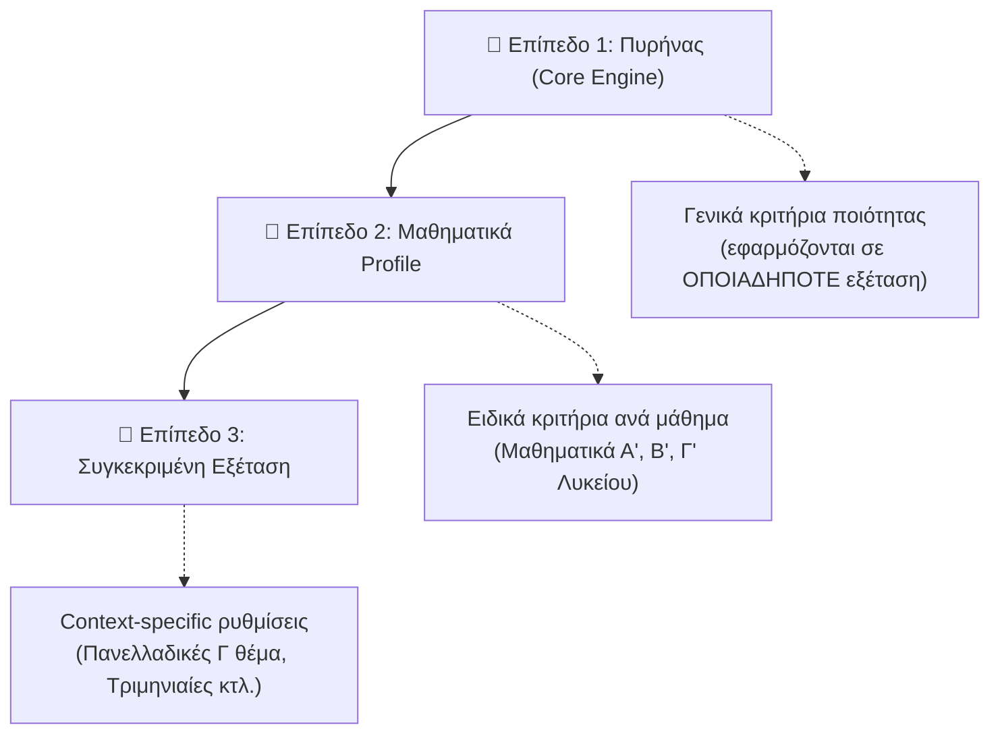
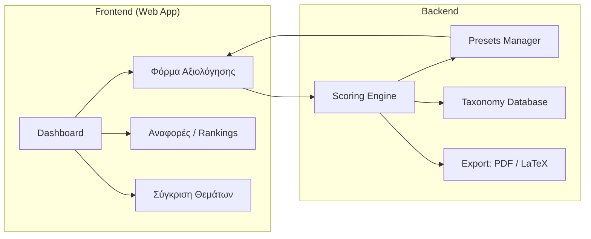
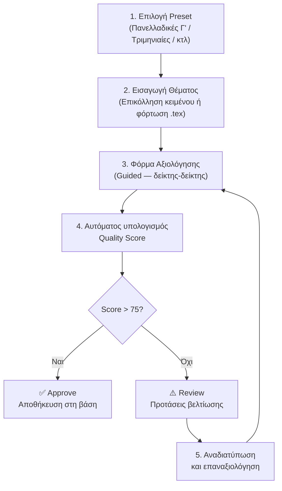

# ExamCritic — Εργαλείο Αξιολόγησης Θεμάτων Μαθηματικών

## Όραμα

Ένα εργαλείο (web app) που επιτρέπει σε καθηγητές Μαθηματικών να αξιολογούν **μεθοδικά** τα θέματα εξετάσεων — Πανελλαδικών, προαγωγικών, ή εσωτερικών — με βάση ένα πλαίσιο μετρήσιμων κριτηρίων. Ο τελικός στόχος: κάθε θέμα λαμβάνει έναν **Βαθμό Ποιότητας (Quality Score)** που αντικατοπτρίζει πόσο καλά εκπληρώνει τον παιδαγωγικό του σκοπό.

---

## Αρχιτεκτονική Σχεδιασμού

### Τα 3 επίπεδα γενίκευσης

---

## Επίπεδο 1: Πυρήνας — Γενικά Κριτήρια

Αυτά ισχύουν **ανεξαρτήτως** μαθήματος, τάξης, ή εξέτασης.

### Κ1. Μαθηματική Αρτιότητα (Mathematical Soundness) — 15 pts

| Δείκτης | Ερώτηση | Κλίμακα | Βαθμός |
|---------|---------|---------|--------|
| Κ1.1 Ορθότητα | Η εκφώνηση είναι μαθηματικά ορθή; (λύσιμο, σωστοί τύποι) | 0=σφάλμα / 3=σωστή | 3 |
| Κ1.2 Πληρότητα | Δίνονται όλα τα δεδομένα; Λείπουν υποθέσεις; | 0=ελλιπής / 3=πλήρης | 3 |
| Κ1.3 Ακρίβεια γλώσσας | Σαφής, αυστηρή μαθηματική διατύπωση; | 0–3 | 3 |
| Κ1.4 Συνέπεια συμβολισμού | Χρήση ενιαίων συμβόλων σε όλο το θέμα | 0–3 | 3 |
| Κ1.5 Τυπογραφική αρτιότητα | Σωστό LaTeX, ευανάγνωστοι τύποι, σχήματα | 0–3 | 3 |

### Κ2. Σαφήνεια Διατύπωσης (Clarity) — 10 pts

| Δείκτης | Ερώτηση | Κλίμακα | Βαθμός |
|---------|---------|---------|--------|
| Κ2.1 Κατανόηση 1ης ανάγνωσης | Ο μαθητής καταλαβαίνει τι ζητείται; | 0–3 | 3 |
| Κ2.2 Απουσία πλεονασμών | Χωρίς περιττές πληροφορίες που μπερδεύουν | 0–2 | 2 |
| Κ2.3 Σαφείς οδηγίες | "Να αποδείξετε" vs "Να δείξετε" — ξεκάθαρα; | 0–2 | 2 |
| Κ2.4 Ευθυγράμμιση με σχολικό λεξιλόγιο | Η ορολογία ταιριάζει με αυτήν του βιβλίου; | 0–3 | 3 |

### Κ3. Δομική Ακεραιότητα (Structural Integrity) — 10 pts

| Δείκτης | Ερώτηση | Κλίμακα | Βαθμός |
|---------|---------|---------|--------|
| Κ3.1 Αλυσιδωτή δομή | Τα ερωτήματα χτίζουν σταδιακά; | 0=ανεξάρτητα / 1=μερική / 2=πλήρης αλυσίδα | 4 |
| Κ3.2 Ανθεκτικότητα σε αποτυχία | Αν ο μαθητής δεν κάνει το (α), χάνει τα υπόλοιπα; | 0=ναι(κακό) / 1=μερικά / 2=ανεξάρτητα | 4 |
| Κ3.3 Κλιμάκωση δυσκολίας | Ξεκινάει εύκολα και κλιμακώνεται; | 0/1/2 | 2 |

> [!TIP]
> Ο δείκτης Κ3.1 και Κ3.2 βρίσκονται σε **ένταση** μεταξύ τους: η τέλεια αλυσίδα (Κ3.1=2) μπορεί να σημαίνει χαμηλή ανθεκτικότητα (Κ3.2=0). Ένα καλό θέμα βρίσκει ισορροπία — π.χ. αλυσίδα (α)→(β)→(γ) αλλά (δ) ανεξάρτητο.

---

## Επίπεδο 2: Ειδικά Κριτήρια Μαθηματικών

Αυτά προσαρμόζονται ανά **τάξη** αλλά παραμένουν κοινά εντός του μαθήματος.

### Κ4. Κάλυψη Ύλης (Content Coverage) — 20 pts

| Δείκτης | Ερώτηση | Βαθμός |
|---------|---------|--------|
| Κ4.1 Πλήθος διαφορετικών μαθηματικών τύπων (taxonomy) | 1pt ανά τύπο, max 5 | 5 |
| Κ4.2 Πλήθος κλάδων/ενοτήτων που αγγίζονται | 2pt ανά κλάδο, max 8 | 8 |
| Κ4.3 Rarity Score — χρήση ερωτημάτων που σπάνια εμφανίζονται | 1pt ανά σπάνιο, max 4 | 4 |
| Κ4.4 Αποφυγή μονοθεματικότητας | 0=μονοθεματικό / 3=πλήρης ποικιλία | 3 |

**Οι "κλάδοι" ανά τάξη:**

| Τάξη | Κλάδοι |
|------|--------|
| Γ΄ Λυκείου (Ανάλυση) | Όρια, Παράγωγος, Θεωρήματα ΔΛ, Ολοκληρώματα, Εφαρμογές |
| Β΄ Λυκείου | Πολυώνυμα, Ακολουθίες, Τριγωνομετρία, Εκθετικά/Λογαριθμικά, Πιθανότητες |
| Α΄ Λυκείου | Εξισώσεις, Ανισώσεις, Συναρτήσεις, Γεωμετρία |

### Κ5. Βαθμός Δυσκολίας (Difficulty Calibration) — 15 pts

> [!IMPORTANT]
> **Η δυσκολία δεν βαθμολογείται γραμμικά** — βαθμολογείται ως **απόσταση από τον στόχο**. Αν ένα "Α θέμα" είναι πολύ δύσκολο, αυτό είναι εξίσου κακό με ένα "Γ θέμα" που είναι πολύ εύκολο.

**Βήμα 1:** Υπολογίζεται η "Raw Difficulty" (RD) σε κλίμακα 0–10:

| Παράγοντας | Βαρύτητα |
|------------|----------|
| Τεχνική πολυπλοκότητα υπολογισμών | ×2 |
| Βάθος θεωρητικής κατανόησης | ×2 |
| Πλήθος βημάτων στη λύση | ×1 |
| Απαίτηση πρωτότυπης σκέψης (vs εξοικείωση) | ×1 |

**Βήμα 2:** Σύγκριση RD με Target Difficulty (TD) ανά τύπο θέματος:

| Τύπος θέματος | Target Difficulty |
|---------------|-------------------|
| Θέμα Α (Θεωρία) | 1–3 |
| Θέμα Β (Βασική εφαρμογή) | 3–5 |
| Θέμα Γ (Μεσαία σύνθεση) | 5–7 |
| Θέμα Δ (Ανώτερη σύνθεση) | 7–9 |
| Τριμηνιαίες / Εσωτερικές | Ρυθμιζόμενο |

**Βαθμολόγηση:** `Difficulty Score = 15 - 3 × |RD - midpoint(TD)|` (clamped to 0–15)

Αν η δυσκολία πέφτει ακριβώς στο target range → πλήρης βαθμός (15/15).

### Κ6. Διδακτική Αξία (Pedagogical Value) — 20 pts

| Δείκτης | Ερώτηση | Βαθμός |
|---------|---------|--------|
| Κ6.1 Εννοιολογική κατανόηση | Ελέγχει βαθιά κατανόηση ή απλή μηχανική εφαρμογή; | 0–4 |
| Κ6.2 Ανακαλυπτική μάθηση | Οδηγεί τον μαθητή να "ανακαλύψει" κάτι; | 0–4 |
| Κ6.3 Μεταφορά γνώσης | Μπορεί να χρησιμεύσει ως "παράδειγμα μεθόδου" στη διδασκαλία; | 0–4 |
| Κ6.4 Αντιμετώπιση παρανοήσεων | Ελέγχει/αποκαλύπτει κοινά σφάλματα μαθητών; | 0–4 |
| Κ6.5 Σύνδεση θεωρίας–εφαρμογής | Ισορροπία αυστηρής μαθηματικής σκέψης και πρακτικής εφαρμογής | 0–4 |

### Κ7. Χρονική Εφικτότητα (Time Feasibility) — 10 pts

| Δείκτης | Κλίμακα | Βαθμός |
|---------|---------|--------|
| Εκτιμώμενος χρόνος λύσης vs διαθέσιμος | 0=αδύνατο / 5=τέλεια ταιρ. / 0=πολύ εύκολο | 10 |

Αυτό πάλι έχει "U-shape": αν λύνεται σε 5' ένα θέμα 25', είναι κακό. Αν χρειάζεται 50', πάλι κακό.

**Τύπος:** `Time Score = 10 - 2 × |estimated_minutes - target_minutes| / target_minutes × 10` (clamped 0–10)

---

## Συνολικός Πίνακας Βαθμολόγησης

| Κριτήριο | Βαθμός | Φύση |
|----------|--------|------|
| Κ1. Μαθηματική Αρτιότητα | 15 | Core — Universal |
| Κ2. Σαφήνεια Διατύπωσης | 10 | Core — Universal |
| Κ3. Δομική Ακεραιότητα | 10 | Core — Universal |
| Κ4. Κάλυψη Ύλης | 20 | Math-specific |
| Κ5. Βαθμός Δυσκολίας | 15 | Context-specific |
| Κ6. Διδακτική Αξία | 20 | Math-specific |
| Κ7. Χρονική Εφικτότητα | 10 | Context-specific |
| **ΣΥΝΟΛΟ** | **100** | |

### Ερμηνεία Quality Score

| Εύρος | Χαρακτηρισμός | Σημασία |
|-------|--------------|---------|
| 90–100 | ⭐ Εξαιρετικό | Πρότυπο θέμα — μπορεί να χρησιμεύσει ως reference |
| 75–89 | ✅ Πολύ Καλό | Μικρές βελτιώσεις στη διατύπωση/δομή |
| 60–74 | ⚠️ Αποδεκτό | Χρειάζεται τροποποιήσεις (π.χ. μονοθεματικό ή λάθος δυσκολία) |
| 40–59 | 🔶 Προβληματικό | Σημαντικά ζητήματα — αναδιατύπωση/αναδόμηση |
| 0–39 | ❌ Ακατάλληλο | Μαθηματικά σφάλματα, ημιτελές, ή εκτός ύλης |

---

## Επίπεδο 3: Προσαρμογή ανά Εξέταση

Το εργαλείο θα προσφέρει **presets** για κοινές περιπτώσεις:

### Πανελλαδικές Μαθηματικά Γ΄ Λυκείου

| Preset | Target Difficulty | Target Time | Ειδικές βαρύτητες |
|--------|-------------------|-------------|-------------------|
| Θέμα Α | 1–3 | 15' | Κ4 ×0.5 (λιγότερη ποικιλία OK) |
| Θέμα Β | 3–5 | 20' | Κ6.1 ×1.5 (εννοιολόγηση σημαντική) |
| Θέμα Γ | 5–7 | 25' | Κ4 ×1.5 (ποικιλία κρίσιμη) |
| Θέμα Δ | 7–9 | 30' | Κ6.2 ×2 (πρωτοτυπία κρίσιμη) |

### Τριμηνιαίες Εξετάσεις

| Preset | Target Difficulty | Target Time |
|--------|-------------------|-------------|
| Εύκολη (baseline) | 2–4 | 15' |
| Μεσαία | 4–6 | 20' |
| Δύσκολη | 5–7 | 25' |

### Εργασίες για Σπίτι

| Preset | Ειδικό |
|--------|--------|
| Ημερήσια άσκηση | Κ7: Target 10', Κ5: TD=3–5 |
| Εβδομαδιαία εργασία | Κ7: Target 45', Κ4 ×2 (ποικιλία!) |

---

## Τεχνική Υλοποίηση

### Προτεινόμενη αρχιτεκτονική

### Τεχνολογίες

| Στοιχείο | Τεχνολογία | Σκεπτικό |
|----------|------------|----------|
| Frontend | Vite + React | Γρήγορο, μοντέρνο, εύκολα forms |
| Styling | CSS custom | Premium αισθητική |
| Backend | Τοπικό (LocalStorage ή JSON) | Κανένα server — offline-first |
| Export | jsPDF + html2canvas | PDF αναφορές |
| LaTeX integration | Ανάγνωση .tex αρχείων | Αυτόματη εξαγωγή metadata |

> [!NOTE]
> **Offline-first σχεδίαση:** Καμία εξάρτηση από server. Ο καθηγητής δουλεύει τοπικά, τα δεδομένα αποθηκεύονται στον browser ή σε JSON αρχεία. Αυτό κάνει το εργαλείο χρησιμοποιήσιμο χωρίς internet.

---

## UX — Εμπειρία Χρήστη

### Flow εργασίας καθηγητή

### Βασικές οθόνες

1. **Dashboard** — Overview όλων των αξιολογημένων θεμάτων, ταξινομημένα κατά score
2. **Evaluation Form** — Guided wizard: ο καθηγητής κλικάρει τιμές ανά δείκτη (radio buttons, sliders)
3. **Report Card** — Radar chart ανά κριτήριο + breakdown ανά δείκτη
4. **Comparison View** — Side-by-side σύγκριση 2 θεμάτων
5. **Taxonomy Explorer** — Πόσο συχνά εμφανίζεται κάθε τύπος ερωτήματος στα αξιολογημένα θέματα

---

## Open Questions

> [!IMPORTANT]
> **1. Scope MVP:** Ξεκινάμε μόνο με Μαθηματικά Γ΄ Λυκείου (Πανελλαδικές) ως MVP, ή θέλεις από την αρχή να υποστηρίζει πολλαπλές τάξεις;

> [!IMPORTANT]
> **2. Data format:** Θέλεις να μπορεί ο καθηγητής να φορτώνει `.tex` αρχεία (αυτόματη ανάγνωση εκφώνησης), ή αρκεί copy-paste κειμένου;

> [!IMPORTANT]
> **3. AI-assisted scoring:** Θέλεις κάποιοι δείκτες να υπολογίζονται αυτόματα (π.χ. Κ1.5 τυπογραφική αρτιότητα, Κ4.1 αναγνώριση τύπων), ή θα είναι 100% χειροκίνητο;

> [!IMPORTANT]
> **4. Ονομασία:** Σου αρέσει το **ExamCritic** ή προτιμάς κάτι ελληνικό (π.χ. **ΘεμαΚριτής**, **ΑξιοΜάθ**);

## Verification Plan

### MVP Validation
- Αξιολόγηση 10 θεμάτων (G_01 – G_10) με το σύστημα
- Σύγκριση scores με τις "ανθρώπινες" αξιολογήσεις του audit
- Ρύθμιση βαρών αν χρειαστεί

### User Testing
- Ο καθηγητής δοκιμάζει τη φόρμα σε 5 θέματα
- Μέτρηση χρόνου (στόχος: < 5 λεπτά ανά θέμα)
